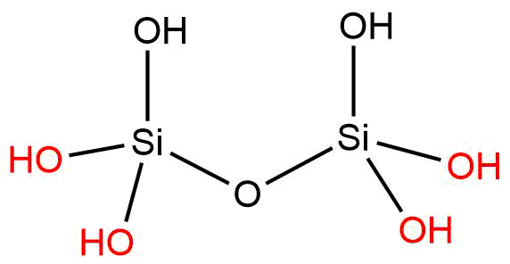
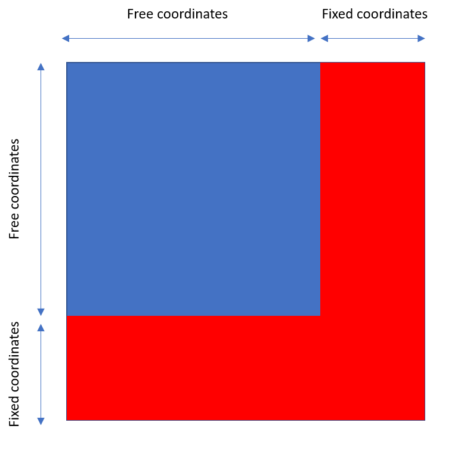

# gaussian_free_E
scripts to perform frequency analysis and compute free energy of surface species (species with constrained atoms) in Gaussian

## Introduction

Gaussian09 has inbuilt features to calculate the free energies (translational, rotational, and vibrational) of gas phase species. However, it does not readily calculate the free energies of species with constrained atoms. An example of this can be when we are trying to calculate the free energy of surface species. The surface is at times represented by a small cluster, where the cluster is capped by terminating atoms and some peripheral atoms of the cluster are held fixed to mimic the rigidity of the surface. The figure below shows a vicinal silanol cluster used to represent a vicinal silanol site on the surface of silica.

Here, the cluster is capped by hydrogen atoms. And the peripheral OH groups (shown in red) are held fixed. To calculate the vibrational free energy we expand the enregy around the minimum (structure corresponding to a local minima) as follows:

Here, ∆<strong>x</strong> is the deviation from the minima, <strong>H</strong> is the hessian computed at the minima, and <em>E</em>0 is the energy of the minima. H is written as follows:

Here <em>x</em>i is the ith coordinate. A molecule with N atoms has a total of 3N coordinates. Now, if we divide the hessian matrix into coordinates of peripheral (fixed) and non-peripheral (free) atoms, we can represent it as follows:

Here, the red portion refers to peripheral atoms (fixed) and blue section refers to non-peripheral atoms (free). To eliminate the effects of the peripheral atoms only the blue sub-matrix is considered and is hence referred to as the reduced hessian represented as <strong>H</strong>red.

The reduced hessian is mass weighted and diagonalized as follows:

Here, <em>M</em>i is the mass of the atom corresponding to coordinate <em>x</em>i.

Eigenvalues of the matrix XXXXXX are given as follows:

And they can be used to compute the normal frequencies as follows:

Finally, the vibrational frequencies can be used to compute the vibrational partition function as followos:

The vibrational partition function can then be used to calculate the vibrational contribution to the free energy:

## Usage

Codes with functioncs are in g_free_e. And a test example is in the folder tests. 

When running a gaussian calculation generate a checkpoint file and convert it to a formatted checkpoint file using the following:

"checkpoint filename" formchk "formatted checkpoint filename"

The formatted checkpoint file contains the second order derivatives (Hessian). Follwing this run the generete_report.py as follows:

python generate_rport.py <.log filename> <formatted checkpoint filename>

Example, python generate_report opt.log stuff.fchk.

$\delta$

$-b \pm \sqrt{b^2 - 4ac} \over 2a$
$x = a_0 + \frac{1}{a_1 + \frac{1}{a_2 + \frac{1}{a_3 + a_4}}}$
$\forall x \in X, \quad \exists y \leq \epsilon$

# This is an <h1> tag

###### This is an <h6> tag

Description
===========
Cheatsheet for LaTex, using Markdown for markup. I use this with [atom.io](https://atom.io/)
and :package:`markdown-preview-plus` to write math stuff. :package:`keyboard-localization`
is necessary when using an international layout (like [swiss] german).

Further Reference and source: ftp://ftp.ams.org/pub/tex/doc/amsmath/short-math-guide.pdf

Example expressions / functions
============================

Input             | Rendered        |
-----------------:|----------------:|
`$a = b + c − d$` | $a = b + c − d$ |
`$\sqrt{?\frac{\pi}{2}}$` | $\sqrt{\frac{\pi}{2}}$ |
`$y = a x_1^2 + b x_2 + c$` | $y = a x_1^2 + b x_2 + c$ |

Special characters / Symbols
============================
###Latin:
#####No dot:  
`\imath` $\rightarrow$ $\imath$,
`\jmath` $\rightarrow$ $\jmath$

#####Hat:  
`\hat{\imath}`  $\rightarrow$ $\hat{\imath}$,
`\hat{\jmath}`  $\rightarrow$ $\hat{\jmath}$

###Greek Letters:
#####Capital:
LaTex      |   | LaTex    |   |
----------:|--:|---------:|--:|
`\Gamma`   | Γ | `\Delta` | ∆ |
`\Lambda`  | Λ | `\Phi`   | Φ |
`\Pi`      | Π | `\Psi`   | Ψ |
`\Sigma`   | Σ | `\Theta` | Θ |
`\Upsilon` | Υ | `\Xi`    | Ξ |
`\Omega`   | Ω |          |   |

#####Lowercase:
LaTex      |   | LaTex     |   |
----------:|--:|----------:|--:|
`\alpha`   | α | `\nu`     | ν |
`\beta`    | β | `\kappa`  | κ |
`\gamma`   | γ | `\lambda` | λ |
`\delta`   | δ |  `\mu`    | µ |    
`\epsilon` | ϵ | `\zeta`   | ζ |
`\eta`     | η | `\theta`  | θ |
`\iota`    | ι | `\xi`     | ξ |
`\pi`      | π | `\rho`    | ρ |
`\sigma`   | σ | `\tau`    | τ |
`\upsilon` | υ | `\phi`    | φ |
`\chi`     | χ | `\psi`    | ψ |
`\omega`   | ω |           |   |

#####Other:
LaTex       |   | LaTex       |   |
-----------:|---|------------:|--:|
`\digamma`  | ϝ | `varepsilon`| ε       |
`\varkappa` | ϰ | `\varphi`   | ϕ       |
`\varpi`    | ϖ | `\varrho`   | ϱ       |
`\varsigma` | ς | `\vartheta` | ϑ       |
`\eth`      | ð | `\hbar`     | $\hbar$ |

###Other:
####Other Symbols
LaTex         |   | LaTex            |   |
-------------:|---|-----------------:|--:|
`\partial`    | ∂ | `\infty`         | ∞ |
`\wedge`      | ∧ | `\vee`           | ∨ |
`\neg` `\not` | ¬ |                  |   |
`\bot`        | ⊥ | `\top`           | ⊤ |
`\nabla`      | ∇ | `\varnothing`    | ∅ |
`\angle`      | ∠ | `\measuredangle` | ∡ |
`\surd`       | √ | `\forall`        | ∀ |
`\exists`     | ∃ | `\nexists`       | ∄ |

####Relational Symbols
LaTex             |   | LaTex              |          |
-----------------:|---|-------------------:|---------:|
`\hookrightarrow` | ↪      | `\Rightarrow`     | ⇒         |
`\rightarrow`     | →      | `\Leftrightarrow` | ⇔         |
`\nrightarrow`    | ↛      | `\mapsto`         | $\mapsto$ |
`\geq`            | ≥      | `\leq`            | ≤         |
`\equiv`          | ≡      | `\sim`            | ∼         |
`\gg`             | ≫      | `\ll`            | ≪          |
`\subset`          | ⊂     | `\subseteq`     | ⊆           |
`\in`             | ∈      | `\notin`         | ∉          |
`\mid`            | $\mid$ | `\propto`        | ∝          |
`\perp`            | ⊥     | ` \parallel`     | ∥          |
`\vartriangle`     | $\vartriangle$

####Binary operators
LaTex        |   | LaTex  |   |
------------:|---|-------:|--:|
`\wedge`     | ∧ | `\vee` | ∨ |
`\neg``\not` | ¬ |        |   |

####Cumulative operators
LaTex     |           | LaTex       |             |
---------:|-----------|------------:|------------:|
`\int`    | ∫         | `\iint`     | $\iint$     |
`\iiint`  | $\iiint$  | `\idotsint` | $\idotsint$ |
`\prod`   | $\prod$   | `\sum`      | $\sum$      |
`\bigcup` | $\bigcup$ | `\bigcap`   | $\bigcap$   |

